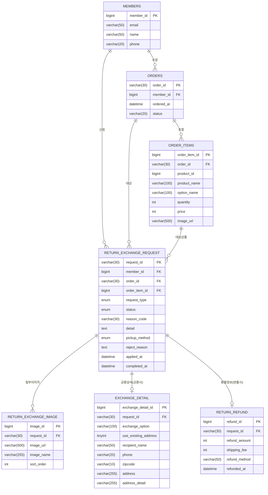

# 교환/반품 ERD 및 DB 테이블 구조

## ERD



---

## 테이블 정의

### 1. `return_exchange_request` — 교환/반품 신청 메인

| 컬럼 | 타입 | NOT NULL | 기본값 | 설명 |
|------|------|----------|--------|------|
| `request_id` | `VARCHAR(30)` | ✓ | — | PK. `RET-YYYYMMDD-NNN` / `EXC-YYYYMMDD-NNN` |
| `member_id` | `BIGINT` | ✓ | — | FK → members |
| `order_id` | `VARCHAR(30)` | ✓ | — | FK → orders |
| `order_item_id` | `BIGINT` | ✓ | — | FK → order_items |
| `request_type` | `ENUM('RETURN','EXCHANGE')` | ✓ | — | 반품 / 교환 |
| `status` | `ENUM('SUBMITTED','IN_PROGRESS','COMPLETED','REJECTED')` | ✓ | `SUBMITTED` | 처리 상태 |
| `reason_code` | `VARCHAR(30)` | ✓ | — | 사유 코드 (하단 참조) |
| `detail` | `TEXT` | — | NULL | 상세 사유 (선택 입력) |
| `pickup_method` | `ENUM('COURIER','VISIT')` | ✓ | `COURIER` | 수거 방법 |
| `reject_reason` | `TEXT` | — | NULL | 반려 사유 (REJECTED 시) |
| `applied_at` | `DATETIME` | ✓ | `CURRENT_TIMESTAMP` | 신청 일시 |
| `completed_at` | `DATETIME` | — | NULL | 처리 완료 일시 |

**reason_code 값**

| 코드 | 설명 | 반품 | 교환 |
|------|------|:----:|:----:|
| `CHANGE_MIND` | 단순 변심 | ✓ | — |
| `SIZE_COLOR` | 사이즈/색상 불만족 | ✓ | — |
| `SIZE_CHANGE` | 사이즈 변경 | — | ✓ |
| `COLOR_CHANGE` | 색상 변경 | — | ✓ |
| `DEFECT` | 상품 불량/파손 | ✓ | ✓ |
| `WRONG_ITEM` | 오배송 | ✓ | ✓ |
| `MISSING_ITEM` | 구성품 누락 | ✓ | ✓ |
| `DESCRIPTION_DIFF` | 상품 설명과 다름 | ✓ | — |
| `OTHER` | 기타 | ✓ | ✓ |

---

### 2. `return_exchange_image` — 첨부 이미지

| 컬럼 | 타입 | NOT NULL | 기본값 | 설명 |
|------|------|----------|--------|------|
| `image_id` | `BIGINT` | ✓ | AUTO_INCREMENT | PK |
| `request_id` | `VARCHAR(30)` | ✓ | — | FK → return_exchange_request |
| `image_url` | `VARCHAR(500)` | ✓ | — | 이미지 저장 경로 |
| `image_name` | `VARCHAR(255)` | — | NULL | 원본 파일명 |
| `sort_order` | `INT` | ✓ | `0` | 표시 순서 (최대 3장) |

---

### 3. `exchange_detail` — 교환 전용 상세 (request_type = EXCHANGE)

| 컬럼 | 타입 | NOT NULL | 기본값 | 설명 |
|------|------|----------|--------|------|
| `exchange_detail_id` | `BIGINT` | ✓ | AUTO_INCREMENT | PK |
| `request_id` | `VARCHAR(30)` | ✓ | — | FK(UNIQUE) → return_exchange_request |
| `exchange_option` | `VARCHAR(100)` | — | NULL | 교환 희망 옵션 (색상/사이즈) |
| `use_existing_address` | `TINYINT(1)` | ✓ | `1` | 기존 배송지 사용 여부 |
| `recipient_name` | `VARCHAR(50)` | — | NULL | 새 배송지: 수령인 |
| `phone` | `VARCHAR(20)` | — | NULL | 새 배송지: 연락처 |
| `zipcode` | `VARCHAR(10)` | — | NULL | 새 배송지: 우편번호 |
| `address` | `VARCHAR(255)` | — | NULL | 새 배송지: 기본 주소 |
| `address_detail` | `VARCHAR(255)` | — | NULL | 새 배송지: 상세 주소 |

---

### 4. `return_refund` — 반품 환불 정보 (request_type = RETURN)

| 컬럼 | 타입 | NOT NULL | 기본값 | 설명 |
|------|------|----------|--------|------|
| `refund_id` | `BIGINT` | ✓ | AUTO_INCREMENT | PK |
| `request_id` | `VARCHAR(30)` | ✓ | — | FK(UNIQUE) → return_exchange_request |
| `refund_amount` | `INT` | ✓ | — | 환불 금액 |
| `shipping_fee` | `INT` | ✓ | `0` | 고객 부담 배송비 (단순변심 등 6,000원) |
| `refund_method` | `VARCHAR(50)` | — | NULL | 환불 수단 (신용카드 취소 등) |
| `refunded_at` | `DATETIME` | — | NULL | 실제 환불 처리 일시 |

---

## DDL (SQL)

```sql
CREATE TABLE return_exchange_request (
    request_id      VARCHAR(30)  NOT NULL,
    member_id       BIGINT       NOT NULL,
    order_id        VARCHAR(30)  NOT NULL,
    order_item_id   BIGINT       NOT NULL,
    request_type    ENUM('RETURN', 'EXCHANGE')                                  NOT NULL,
    status          ENUM('SUBMITTED', 'IN_PROGRESS', 'COMPLETED', 'REJECTED')   NOT NULL DEFAULT 'SUBMITTED',
    reason_code     VARCHAR(30)  NOT NULL,
    detail          TEXT,
    pickup_method   ENUM('COURIER', 'VISIT')  NOT NULL DEFAULT 'COURIER',
    reject_reason   TEXT,
    applied_at      DATETIME     NOT NULL DEFAULT CURRENT_TIMESTAMP,
    completed_at    DATETIME,

    PRIMARY KEY (request_id),
    CONSTRAINT fk_rer_member     FOREIGN KEY (member_id)     REFERENCES members (member_id),
    CONSTRAINT fk_rer_order      FOREIGN KEY (order_id)      REFERENCES orders (order_id),
    CONSTRAINT fk_rer_order_item FOREIGN KEY (order_item_id) REFERENCES order_items (order_item_id)
);

CREATE TABLE return_exchange_image (
    image_id    BIGINT       NOT NULL AUTO_INCREMENT,
    request_id  VARCHAR(30)  NOT NULL,
    image_url   VARCHAR(500) NOT NULL,
    image_name  VARCHAR(255),
    sort_order  INT          NOT NULL DEFAULT 0,

    PRIMARY KEY (image_id),
    CONSTRAINT fk_rei_request FOREIGN KEY (request_id) REFERENCES return_exchange_request (request_id)
);

CREATE TABLE exchange_detail (
    exchange_detail_id   BIGINT       NOT NULL AUTO_INCREMENT,
    request_id           VARCHAR(30)  NOT NULL,
    exchange_option      VARCHAR(100),
    use_existing_address TINYINT(1)   NOT NULL DEFAULT 1,
    recipient_name       VARCHAR(50),
    phone                VARCHAR(20),
    zipcode              VARCHAR(10),
    address              VARCHAR(255),
    address_detail       VARCHAR(255),

    PRIMARY KEY (exchange_detail_id),
    UNIQUE KEY uq_ed_request (request_id),
    CONSTRAINT fk_ed_request FOREIGN KEY (request_id) REFERENCES return_exchange_request (request_id)
);

CREATE TABLE return_refund (
    refund_id      BIGINT       NOT NULL AUTO_INCREMENT,
    request_id     VARCHAR(30)  NOT NULL,
    refund_amount  INT          NOT NULL,
    shipping_fee   INT          NOT NULL DEFAULT 0,
    refund_method  VARCHAR(50),
    refunded_at    DATETIME,

    PRIMARY KEY (refund_id),
    UNIQUE KEY uq_rr_request (request_id),
    CONSTRAINT fk_rr_request FOREIGN KEY (request_id) REFERENCES return_exchange_request (request_id)
);
```
